Display visual dependency graph for Linear items.

## View Options:
1. **Full Graph** - Everything in the initiative
2. **Focused View** - Current item + 2 hops
3. **Critical Path** - Only blocking dependencies
4. **By Status** - Grouped by workflow state
5. **By Team** - Grouped by assignment
6. **Timeline View** - Arranged by dates

## Process:
1. Load graph.json for data
2. Apply requested filters/views
3. Generate Mermaid diagram with:
   - Color coding by status
   - Icons for item types
   - Labeled edges for relationships
   - Grouping boxes for organization
4. Include graph statistics:
   - Total items by type
   - Blocking chains identified
   - Orphaned items
   - Completion percentage

## Interactive Features:
- Click on item to see details
- Highlight paths between items
- Show/hide completed items
- Export to various formats

## Output:

```mermaid
graph TD
    subgraph "Initiative: E-commerce"
        P1[Auth System 🟡]
        P2[Payment 🔴]
    end
    P1 -->|blocks| P2
```

Plus statistics and navigation help